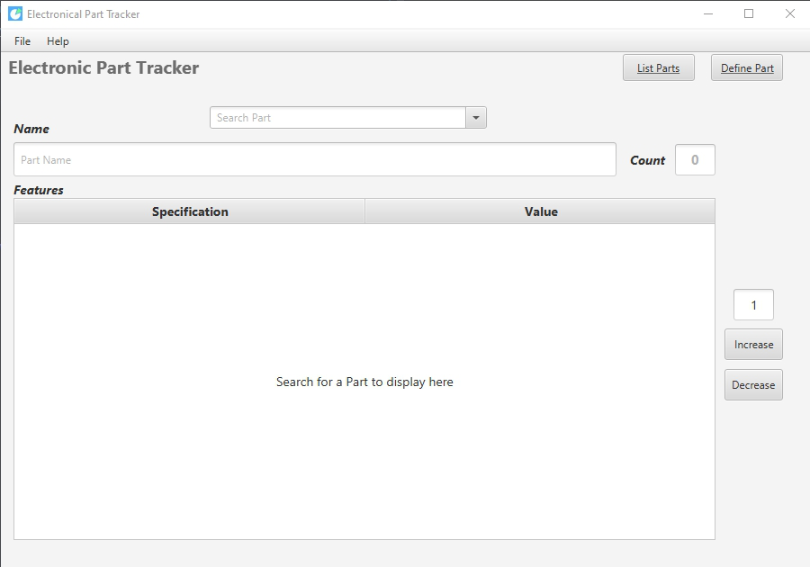
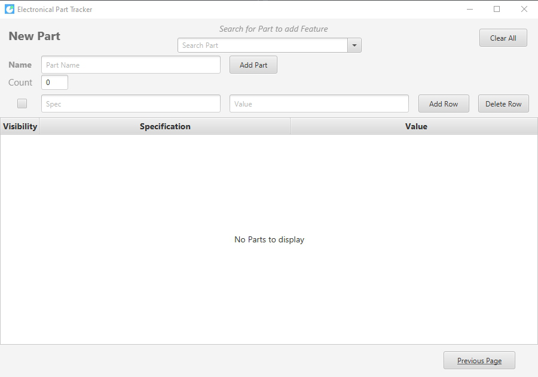
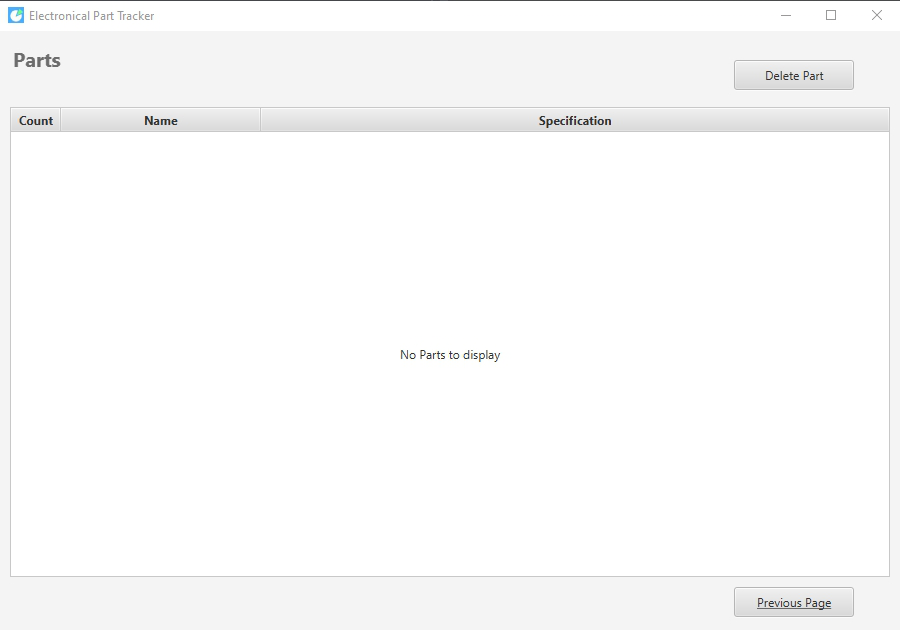
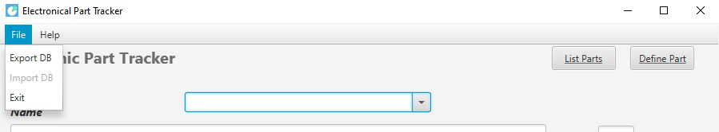

# Electronic Part Tracker Application
   The application allows you to track Count of Electronic Parts you have. 
   You can also display Specifications and Values of your Electronic Parts. 

## How it Works

MainPage allows you to display Part's Count, only "Visible" Specs and Values of these specs.
You can increase and decrease part's count. Default increase & decrease value is 1, you can edit this number.

You can define Part from DefinePart page.
First you have to define a part by writig its Name and Count then press "Add Part" to add this part to DB.
After that you can define Visibility, Specifications and Values of these specs, if this part has no specs or value, you can leave it empty.

ListPart page is for display all the Parts in DB by their count and specs.
Visible/Unvisible values will be shown on Specifications Column. 

### Excel Export/Import
Export DB feature allows you to choose export location.
Import DB feature will be added soon.

## DB Configuration
Leda.db file must be in the same file as Leda.exe